# Architecture Documentation

> Technical architecture of the ADK & Chainlit Agent Builder

## Table of Contents

1. [System Overview](#system-overview)
2. [High-Level Architecture](#high-level-architecture)
3. [Component Architecture](#component-architecture)
4. [Code Generation Pipeline](#code-generation-pipeline)
5. [Workflow Types](#workflow-types)
6. [Module Structure](#module-structure)
7. [Data Flow](#data-flow)
8. [Technology Stack](#technology-stack)
9. [Design Patterns](#design-patterns)

---

## System Overview

The ADK & Chainlit Agent Builder is a visual code generator that enables users to design and deploy multi-agent AI workflows through a drag-and-drop interface. The system generates production-ready Python code that combines Google's Agent Development Kit (ADK) with Chainlit's UI framework.

### Key Capabilities

- **Visual Agent Design**: Drag-and-drop interface for creating agents and tools
- **Multi-Workflow Support**: Sequential, Hierarchical, and Collaborative agent patterns
- **Code Generation**: Produces deployment-ready Python code with Docker configuration
- **GCP Integration**: Built-in support for Vertex AI, Memory Bank, and Cloud Run
- **Validation**: Preflight checks ensure configurations are valid before generation

---

## High-Level Architecture

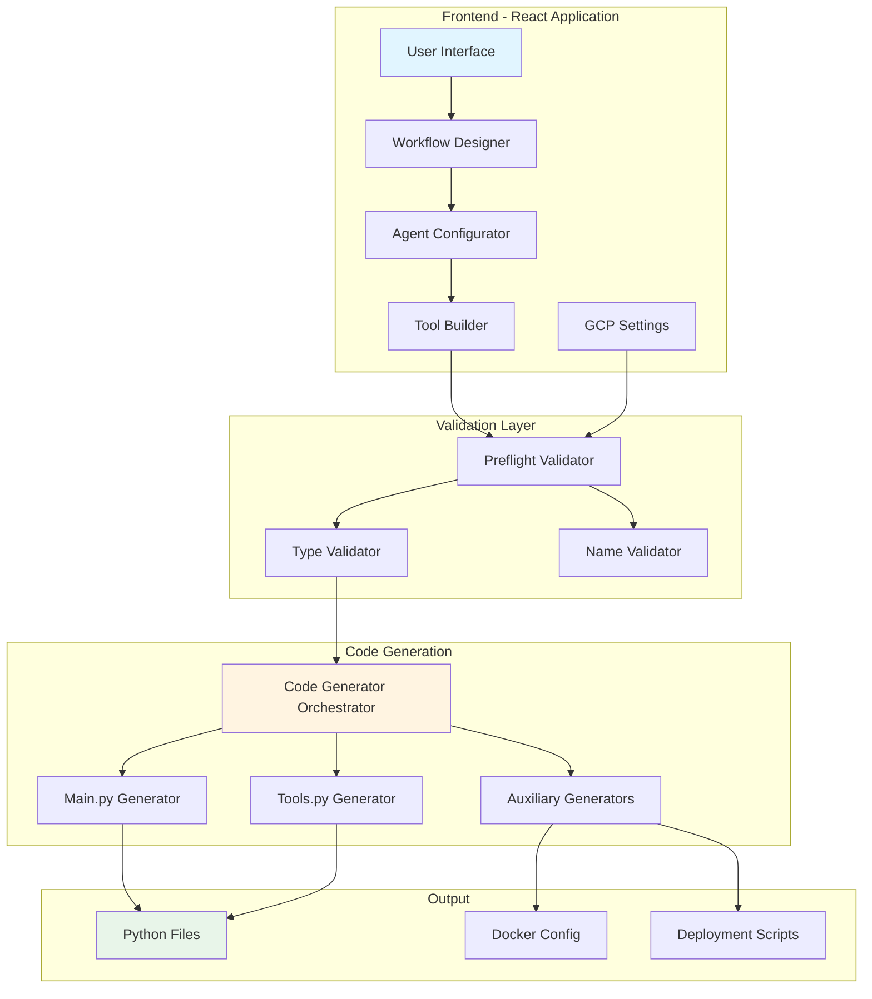

### Architecture Principles

1. **Separation of Concerns**: Each module handles a single responsibility
2. **Validation-First**: All configurations validated before code generation
3. **Modular Generation**: Each output file generated by a specialized module
4. **Type Safety**: TypeScript strict mode with comprehensive type definitions
5. **Testability**: Extensive test coverage with unit and integration tests

---

## Component Architecture

### Frontend Components

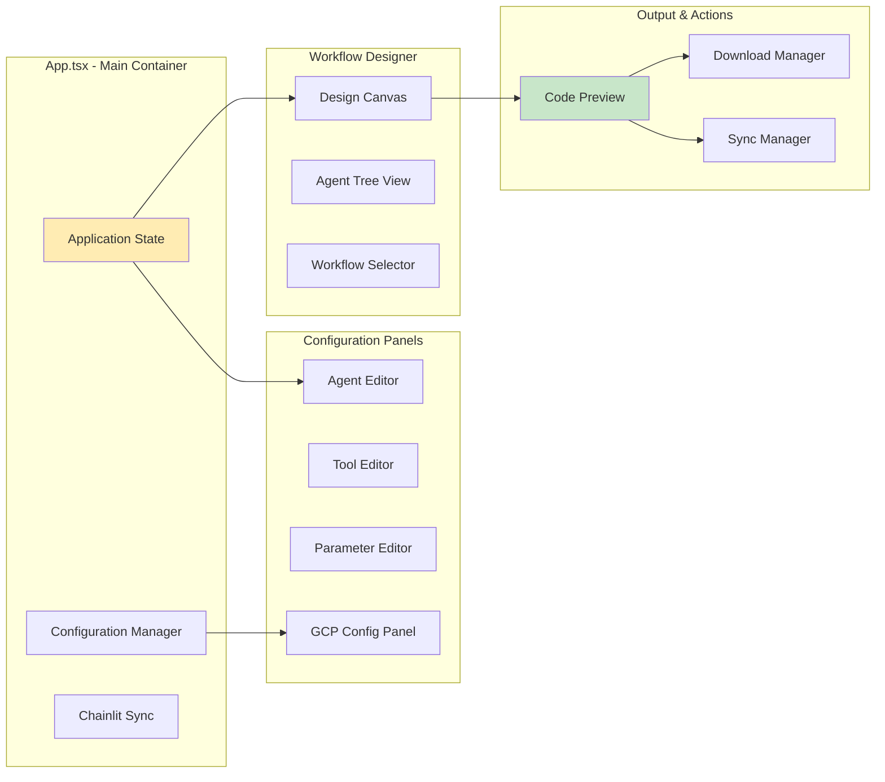

#### Component Responsibilities

| Component | Responsibility | Key Features |
|-----------|---------------|--------------|
| **App.tsx** | Main application container | State management, routing, persistence |
| **WorkflowDesigner** | Visual agent builder | Drag-drop, tree view, workflow selection |
| **AgentPanel** | Agent configuration | LLM selection, prompts, temperature |
| **ToolPanel** | Tool builder | Parameter definition, type mapping |
| **GCPSettings** | Cloud configuration | Project ID, region, Memory Bank toggle |
| **CodePreview** | Generated code display | Syntax highlighting, file tabs |

---

## Code Generation Pipeline

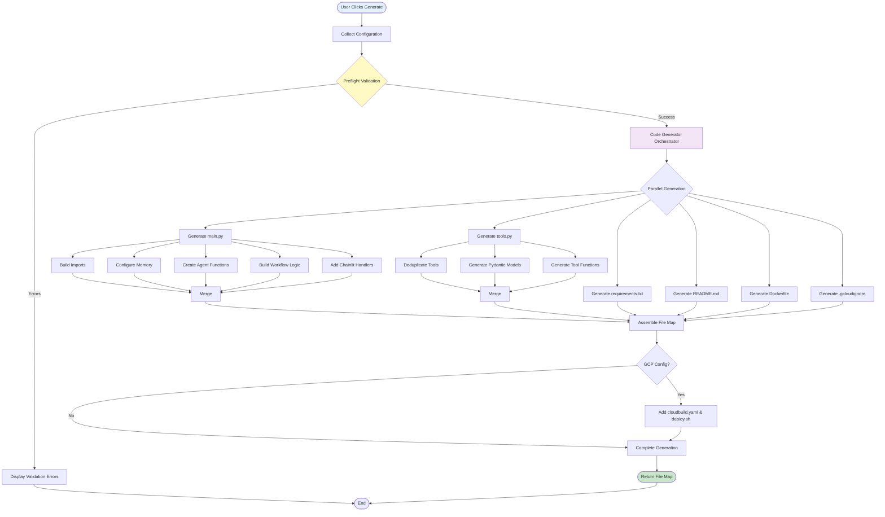

### Generation Flow Stages

1. **Collection**: Gather agents, tools, GCP config from UI state
2. **Validation**: Run preflight checks (names, types, models)
3. **Orchestration**: Delegate to specialized generators
4. **Parallel Generation**: Generate independent files concurrently
5. **Assembly**: Combine into final file map
6. **Conditional GCP**: Add deployment files if GCP configured

---

## Workflow Types

### Sequential Workflow

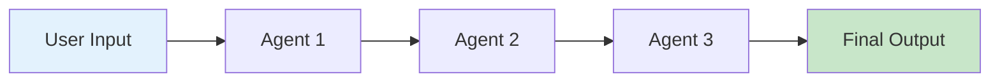

**Use Case**: Processing pipeline where each agent refines output
**Example**: Research → Analysis → Summary

**Generated Code Structure**:
```python
workflow = Sequential(
    agents=[agent_1, agent_2, agent_3]
)
```

### Hierarchical Workflow

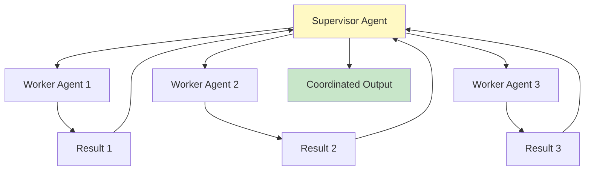

**Use Case**: Delegation pattern with specialized workers
**Example**: Project Manager → {Developer, Designer, QA}

**Generated Code Structure**:
```python
workflow = Hierarchical(
    agents=[supervisor, worker1, worker2, worker3],
    structure={
        supervisor: [worker1, worker2, worker3]
    }
)
```

### Collaborative Workflow

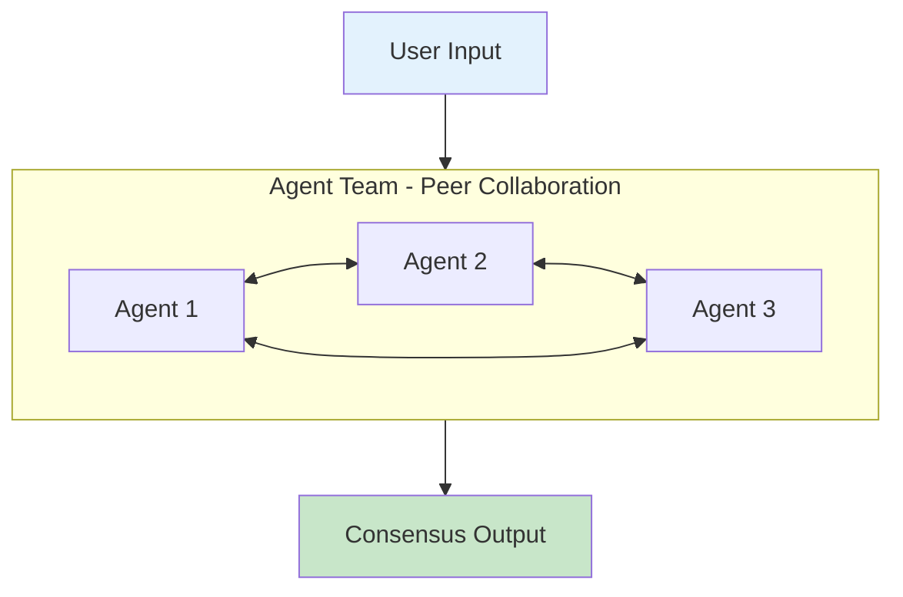

**Use Case**: Equal peers working together on complex problems
**Example**: Creative brainstorming, multi-perspective analysis

**Generated Code Structure**:
```python
workflow = Collaborative(
    agents=[agent_1, agent_2, agent_3]
)
```

---

## Module Structure

### Directory Layout

```
chainlit-adk-wysiwyg/
├── components/                    # React UI components
│   ├── common/                   # Reusable components
│   │   ├── Button.tsx
│   │   ├── Card.tsx
│   │   └── Input.tsx
│   ├── AgentPanel.tsx            # Agent configuration
│   ├── GCPSettings.tsx           # Cloud settings
│   ├── ToolPanel.tsx             # Tool builder
│   └── WorkflowDesigner.tsx      # Visual designer
├── services/                      # Business logic
│   ├── generators/               # Code generation modules
│   │   ├── utils.ts              # String formatting utilities
│   │   ├── toolsGenerator.ts    # tools.py generator
│   │   ├── mainGenerator.ts     # main.py generator
│   │   └── auxiliaryGenerators.ts # Supporting files
│   ├── codeGenerator.ts          # Main orchestrator
│   ├── preflight.ts              # Validation service
│   ├── chainlitSync.ts           # Sync to chainlit_app/
│   └── persistence.ts            # LocalStorage manager
├── types/                         # TypeScript definitions
│   └── index.ts                  # All type definitions
├── test/                          # Test suites
│   ├── integration.test.ts       # Full workflow tests
│   ├── codeGenerator.test.ts    # Generator unit tests
│   ├── preflight.test.ts         # Validation tests
│   └── components.test.tsx       # UI component tests
├── docs/                          # Documentation
│   ├── ARCHITECTURE.md           # This file
│   ├── DEPLOYMENT_GUIDE.md       # Deployment guide
│   ├── API_DOCUMENTATION.md      # API reference
│   └── WORKFLOW_GUIDE.md         # Workflow patterns
├── App.tsx                        # Main React component
└── main.tsx                       # Entry point
```

### Generator Module Architecture

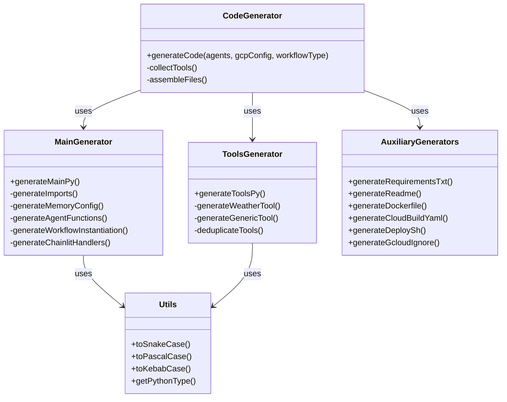

---

## Data Flow

### User Configuration to Generated Code

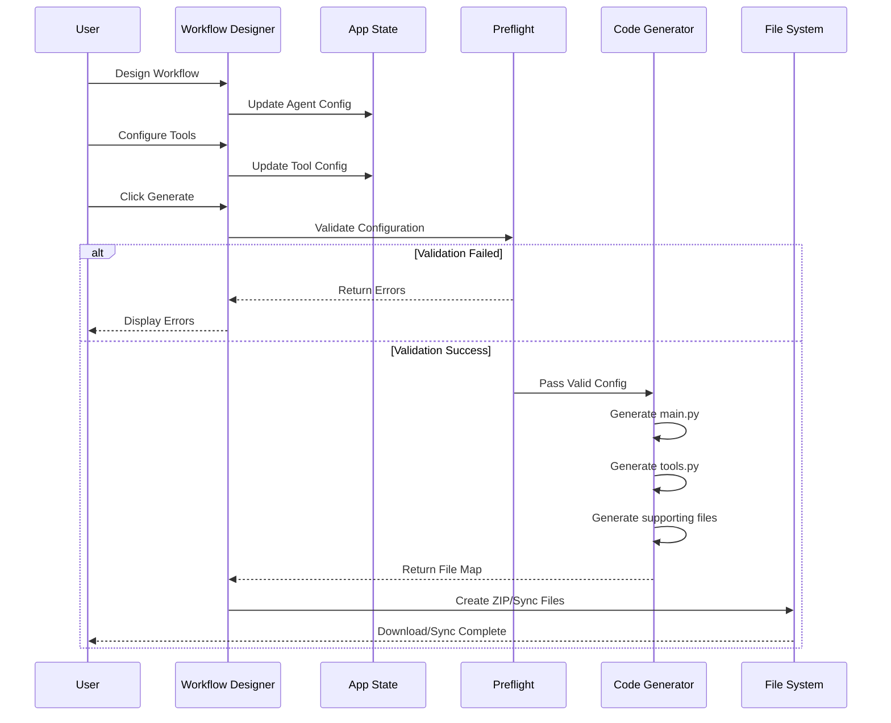

### State Management Flow

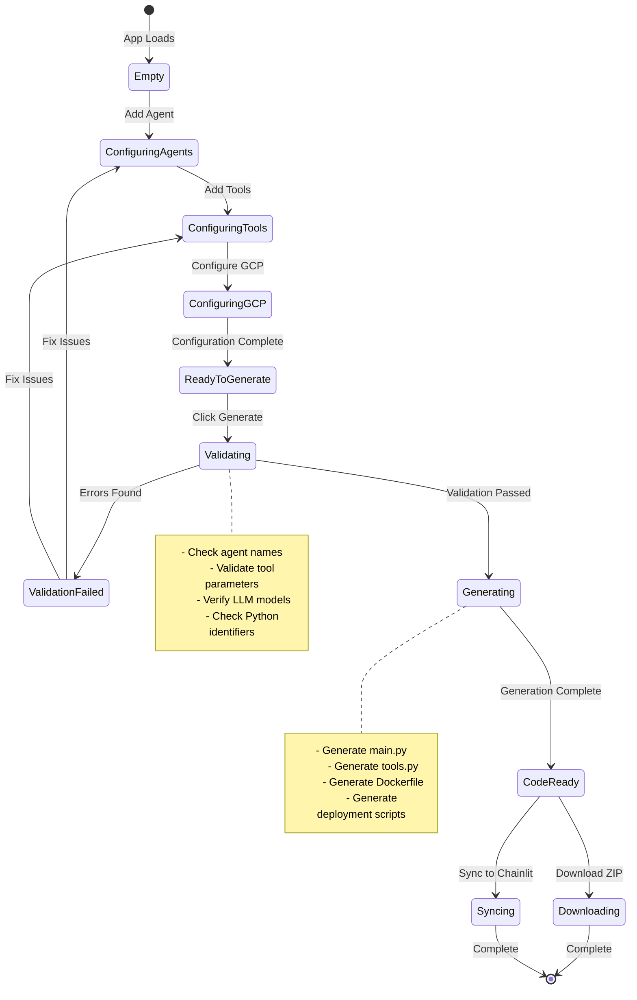

---

## Technology Stack

### Frontend

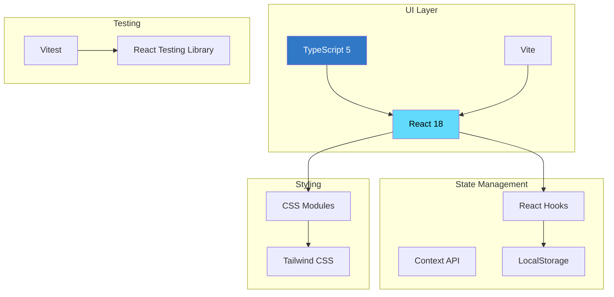

### Backend (Generated Code)

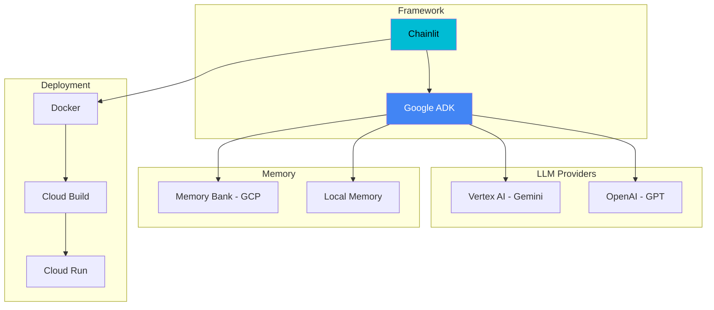

### Technology Choices

| Component | Technology | Rationale |
|-----------|-----------|-----------|
| **UI Framework** | React 18 | Component composition, hooks, performance |
| **Language** | TypeScript 5 | Type safety, better DX, catch errors early |
| **Build Tool** | Vite | Fast HMR, modern tooling, optimized builds |
| **Testing** | Vitest | Fast, Vite-native, compatible with Jest |
| **Backend Framework** | Chainlit | Built for conversational AI, easy deployment |
| **Agent Framework** | Google ADK | Multi-agent support, tool integration |
| **Deployment** | Docker + Cloud Run | Containerized, scalable, serverless |

---

## Design Patterns

### 1. Generator Pattern

Each file type has a dedicated generator module:

```typescript
// Generator interface pattern
export const generateMainPy = (
  agents: Agent[],
  gcpConfig: GCPConfig,
  workflowType: WorkflowType
): string => {
  // Generate complete main.py content
  const imports = generateImports(agents, workflowType);
  const memory = generateMemoryConfig(gcpConfig);
  const agentFunctions = generateAgentCreationFunctions(agents);
  const workflow = generateWorkflowInstantiation(agents, workflowType);

  return assembleFile([imports, memory, agentFunctions, workflow]);
};
```

**Benefits:**
- Single Responsibility Principle
- Easy to test individual generators
- Parallel generation possible
- Clear separation of concerns

### 2. Strategy Pattern

Different workflow types use different generation strategies:

```typescript
function generateWorkflowInstantiation(
  agents: Agent[],
  workflowType: WorkflowType
): string {
  switch (workflowType) {
    case 'Hierarchical':
      return generateHierarchicalWorkflow(agents);
    case 'Collaborative':
      return generateCollaborativeWorkflow(agents);
    case 'Sequential':
    default:
      return generateSequentialWorkflow(agents);
  }
}
```

**Benefits:**
- Easy to add new workflow types
- Clear workflow-specific logic
- Testable in isolation

### 3. Builder Pattern

Complex agent configurations built incrementally:

```typescript
const agent = {
  id: generateId(),
  name: 'Customer Service Agent',
  llmModel: 'gemini-1.5-flash',
  temperature: 0.7,
  tools: [],
  system_prompt: '',
  welcome_message: '',
};

// User adds tools incrementally
agent.tools.push(newTool);
```

**Benefits:**
- Flexible configuration
- Validates at each step
- Clear state progression

### 4. Observer Pattern

State changes propagate to UI components:

```typescript
// App.tsx manages state
const [agents, setAgents] = useState<Agent[]>([]);

// Components observe state
<WorkflowDesigner
  agents={agents}
  onAgentsChange={setAgents}
/>
```

**Benefits:**
- Reactive UI updates
- Decoupled components
- Easy to debug state flow

### 5. Validation Chain Pattern

Multiple validators run in sequence:

```typescript
export function runPreflightValidation({ agents }: PreflightInput) {
  const issues: ValidationIssue[] = [];

  // Chain of validators
  validateAgentCount(agents, issues);
  validateAgentNames(agents, issues);
  validateLLMModels(agents, issues);
  validateTools(agents, issues);
  validateParameters(agents, issues);

  return buildResult(issues);
}
```

**Benefits:**
- Comprehensive validation
- Clear error messages
- Easy to add new validators

---

## Performance Considerations

### Code Generation Performance

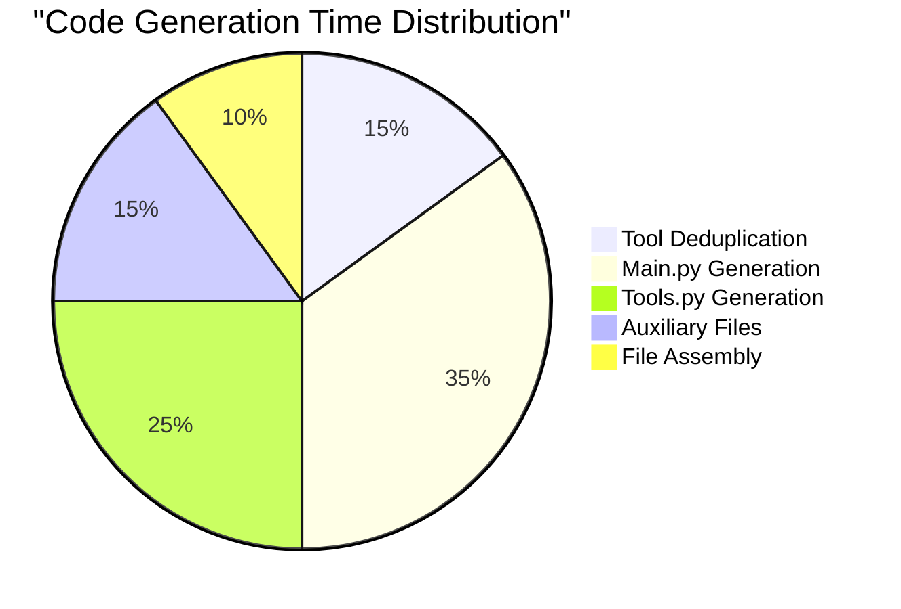

**Optimizations:**
- Tool deduplication uses `Map` for O(1) lookup
- Generators run conceptually in parallel (synchronous but independent)
- Template strings pre-compiled at module load
- Minimal string manipulation with template literals

### UI Performance

- **LocalStorage caching** prevents config loss
- **Debounced validation** reduces unnecessary checks
- **Lazy loading** for code preview syntax highlighting
- **Memoized components** prevent unnecessary re-renders

---

## Security Architecture

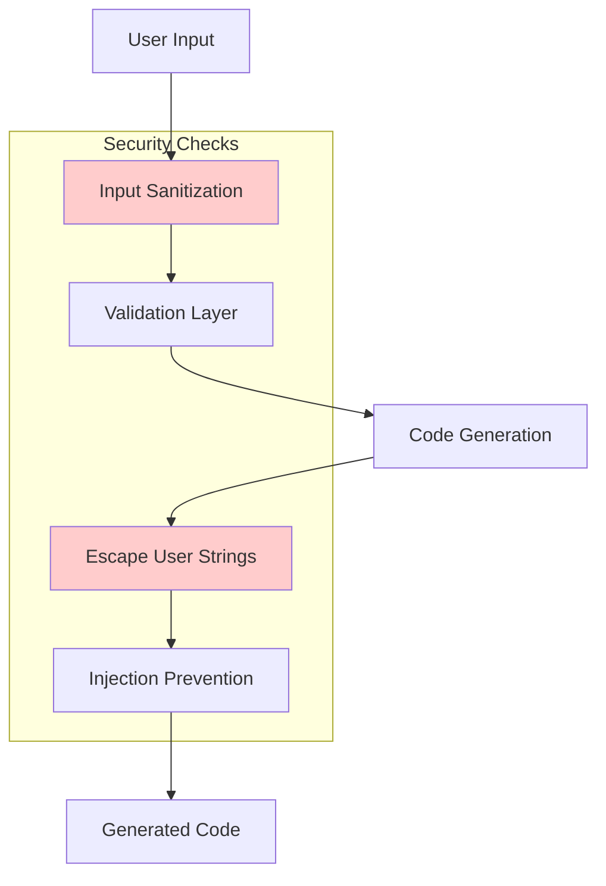

**Security Measures:**
- Input sanitization for agent/tool names
- Python keyword validation
- Template literal escaping for user strings
- No eval() or exec() in generated code
- Service account key validation
- Secret management recommendations

---

## Future Architecture Considerations

### Planned Enhancements

1. **Plugin System**
   - Custom tool templates
   - Community-contributed workflows
   - Third-party LLM providers

2. **Real-time Collaboration**
   - WebSocket-based co-editing
   - Shared workflow templates
   - Team workspaces

3. **Enhanced Deployment**
   - AWS/Azure support
   - Kubernetes manifests
   - Terraform configurations

4. **Monitoring Integration**
   - Built-in observability
   - Performance metrics
   - Cost tracking

---

## Appendix

### Key Type Definitions

```typescript
interface Agent {
  id: string;
  name: string;
  system_prompt: string;
  welcome_message: string;
  input_placeholder: string;
  tools: Tool[];
  llmModel: string;
  temperature: number;
  parentId: string | null;
}

interface Tool {
  id: string;
  name: string;
  description: string;
  parameters: Parameter[];
}

interface Parameter {
  id: string;
  name: string;
  type: 'string' | 'number' | 'boolean';
  description: string;
  required: boolean;
}

interface GCPConfig {
  projectId: string;
  serviceName: string;
  region: string;
  serviceAccountKeyJson: string;
  serviceAccountKeyName: string;
  useMemoryBank: boolean;
}

type WorkflowType = 'Sequential' | 'Hierarchical' | 'Collaborative';
```

### References

- [Google ADK Documentation](https://github.com/google/adk)
- [Chainlit Documentation](https://docs.chainlit.io)
- [React Architecture Patterns](https://reactpatterns.com)
- [TypeScript Best Practices](https://typescript-eslint.io)

---

**Last Updated**: 2025-10-22
**Version**: 1.0.0
